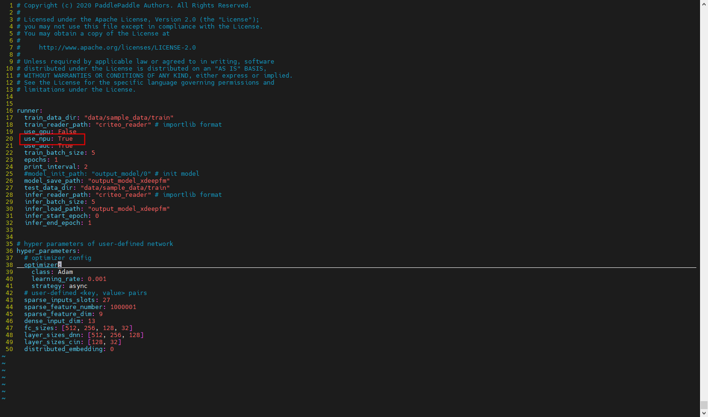
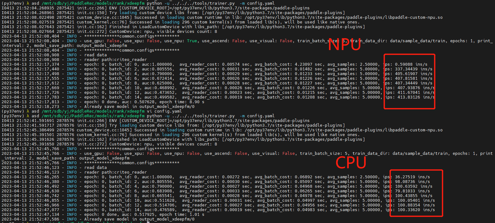
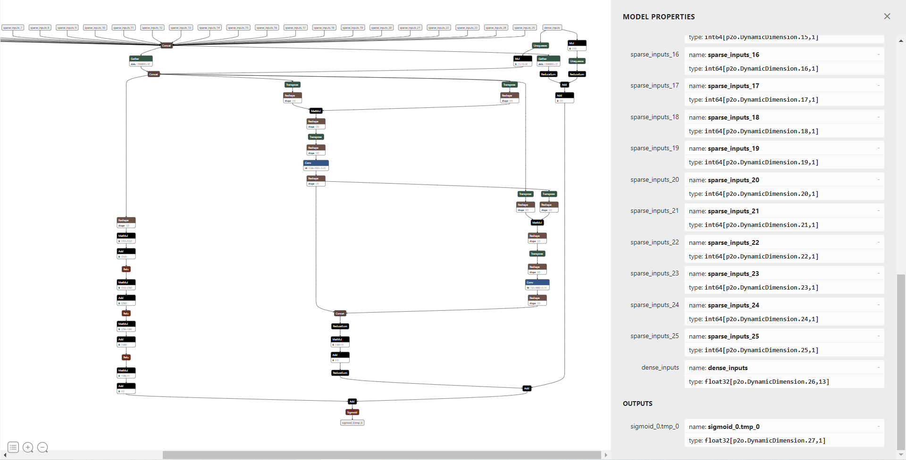
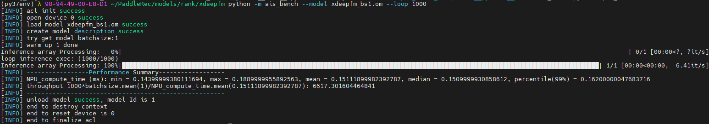

# PaddleRec-xdeepfm-npu-train-infer
 使用鲲鹏CPU+昇腾NPU训练和推理PaddleRec-xdeepfm

## 直接使用镜像
**下载镜像tar包**  
链接：https://pan.baidu.com/s/126f3WxVfc37N-rW_so3NUA?pwd=3a0x  
提取码：3a0x  
解压.zip文件
- Environment  
    - Train:Kunpeng920_5250+Atlas300T  
    - Infer:Kunpeng920_5220+Atlas300I-Pro
- Train  
```
1. docker load -i paddle-npu-xdeepfm-train.tar  
2. docker tag 5ba53d713903 paddle-npu-xdeepfm:train  
3.  
docker run -it --name paddle-npu-dev \  
-v `pwd`:/workspace \  
--workdir=/workspace \  
--pids-limit 409600 \  
--privileged \  
--network=host --shm-size=128G \  
-v /usr/local/Ascend/driver:/usr/local/Ascend/driver \  
-v /usr/local/bin/npu-smi:/usr/local/bin/npu-smi \  
-v /usr/local/dcmi:/usr/local/dcmi \  
paddle-npu-xdeepfm:train \  
/bin/bash  
4. cd /root/PaddleRec/models/rank/xdeepfm/  
5. python -u ../../../tools/trainer.py -m config.yaml  
```
- Infer
```
1. docker load -i paddle-npu-xdeepfm-infer.tar
2. docker tag d424ec10c51e  paddle-npu-xdeepfm:infer
3. 
docker run -it --name paddle-npu-dev \  
-v `pwd`:/workspace \  
--workdir=/workspace \  
--pids-limit 409600 \  
--privileged \  
--network=host --shm-size=128G \  
-v /usr/local/Ascend/driver:/usr/local/Ascend/driver \  
-v /usr/local/bin/npu-smi:/usr/local/bin/npu-smi \  
-v /usr/local/dcmi:/usr/local/dcmi \  
paddle-npu-xdeepfm:infer \  
/bin/bash  
4. cd /root/PaddleRec/models/rank/xdeepfm/  
5. python om_infer.py --om_file=xdeepfm_bs1.om --data_dir=data/sample_data/train/ --reader_file=criteo_reader.py --batchsize=1  
```

## 构建镜像
1. 飞桨自定义接入硬件后端安装  
安装[PaddleCustomDevice](https://github.com/PaddlePaddle/PaddleCustomDevice)（保证网络通畅，可以访问github）  
2. xdeepfm训练  
    1.	进入容器
    2.	git clone https://github.com/PaddlePaddle/PaddleRec.git
    3.	cd PaddleRec/models/rank/xdeepfm
    4.	vim config.yaml，添加use_npu: True，train_batch_size改为50，learning_rate改为0.002，保存修改
    
    5. 	修改net.py将第70和80行的sparse=True改为sparse=False，原因是CustomNPU的lookup_table_v2不支持seleted rows
    6.  python -u ../../../tools/trainer.py -m config.yaml
    
3. xdeepfm动态图转静态图  
[参考链接](https://github.com/PaddlePaddle/PaddleRec/blob/master/doc/inference.md)  
4. 将criteo_reader.py替换到PaddleRec/models/rank/xdeepfm/目录下  
5. xdeepfm静态图推理  
paddle推理脚本改写，见pd_infer.py，将pd_infer.py拷贝到../../../tools/目录  
```
python -u ../../../tools/pd_infer.py --model_file=model_save_path/tostatic.pdmodel --params_file=model_save_path/tostatic.pdiparams --use_gpu=False --data_dir=data/sample_data/train --reader_file=criteo_reader.py --batchsize=1 --benchmark=False
```
6. 静态图转onnx
```
paddle2onnx  --model_dir model_save_path --model_filename tostatic.pdmodel --params_filename tostatic.pdiparams --opset_version 11 --save_file xdeepfm.onnx --enable_onnx_checker True
```
  
7. onnx推理脚本改写  
见onnx_infer.py，将onnx_infer.py拷贝到xdeepfm目录下  
8. onnx模型推理  
```
python -u onnx_infer.py --onnx_file=xdeepfm.onnx --data_dir=data/sample_data/train/ --reader_file=criteo_reader.py --batchsize=1
```   
9. onnx模型转om模型  
```
atc --model=xdeepfm.onnx --framework=5 --output=xdeepfm_bs1 --soc_version=Ascend310P3 --input_shape="sparse_inputs_0:1,1;sparse_inputs_1:1,1;sparse_inputs_2:1,1;sparse_inputs_3:1,1;sparse_inputs_4:1,1;sparse_inputs_5:1,1;sparse_inputs_6:1,1;sparse_inputs_7:1,1;sparse_inputs_8:1,1;sparse_inputs_9:1,1;sparse_inputs_10:1,1;sparse_inputs_11:1,1;sparse_inputs_12:1,1;sparse_inputs_13:1,1;sparse_inputs_14:1,1;sparse_inputs_15:1,1;sparse_inputs_16:1,1;sparse_inputs_17:1,1;sparse_inputs_18:1,1;sparse_inputs_19:1,1;sparse_inputs_20:1,1;sparse_inputs_21:1,1;sparse_inputs_22:1,1;sparse_inputs_23:1,1;sparse_inputs_24:1,1;sparse_inputs_25:1,1;dense_inputs:1,13" --precision_mode=allow_mix_precision
```
10. om脚本改写  
见om_infer.py，将om_infer.py拷贝到xdeepfm目录下  
11. ais_bench安装  
[https://gitee.com/ascend/tools/tree/master/ais-bench_workload/tool/ais_bench](https://gitee.com/ascend/tools/tree/master/ais-bench_workload/tool/ais_bench)
12. om模型推理
```
python om_infer.py --om_file=xdeepfm_bs1.om --data_dir=data/sample_data/train --reader_file=criteo_reader.py --batchsize=1
```
13. om性能测试
```
python -m ais_bench --model xdeepfm_bs1.om --loop 1000
```
  


14. paddle静态图，onnx模型以及om模型在./data/sample_data/train数据集上推理，auc对比，训练参数见config.yaml  

|模型|脚本|auc|atc高级功能参数|
|:---|:---|:---|:---|
|paddle静态图|pd_infer.py|0.5461479786422578|---|
|xdeepfm.onnx|onnx_infer.py|0.5461479786422578|---|
|xdeepfm_bs1.om|om_infer.py|0.5457665903890161|---|
|xdeepfm_bs1.om|om_infer.py|0.5461479786422578|precision_mode=allow_mix_precision|